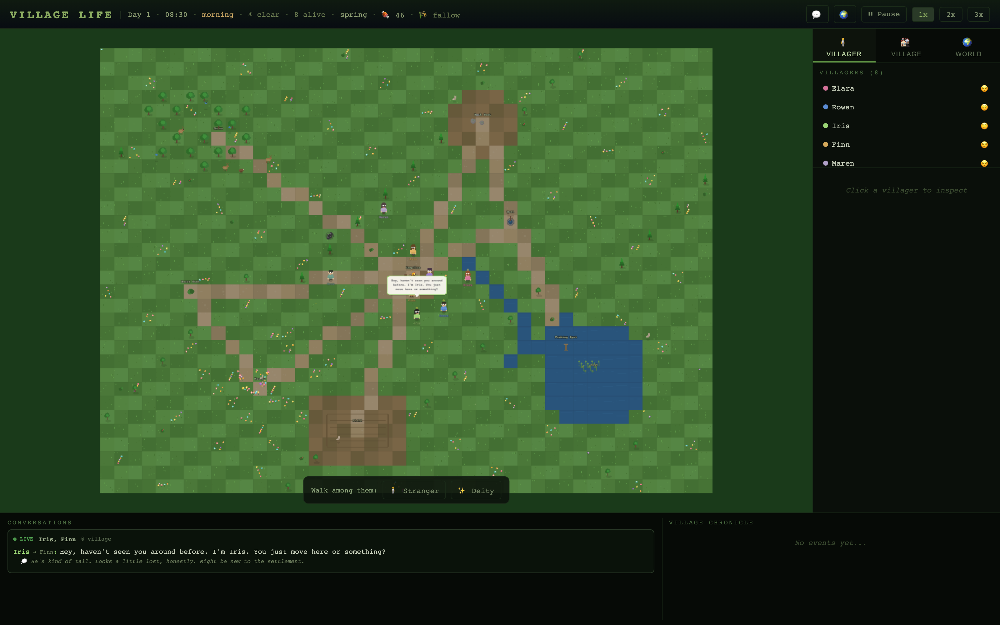
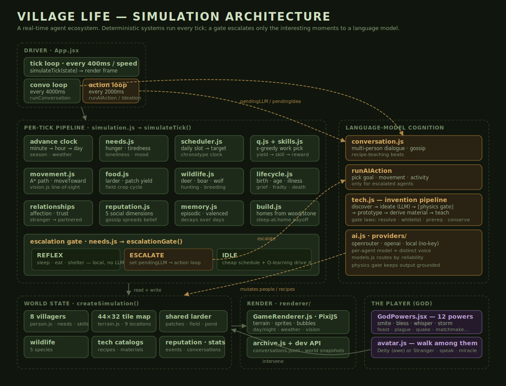

# Village Life

A real-time village simulation. Eight villagers are born into a small world
with food to gather, seasons to weather, skills to learn, relationships to
build, and a tech tree to discover from scratch. They wake, work, talk, fall in
love, raise children, grow old, and die — and you can watch a settlement and its
culture take shape on its own. You can also step in as a god: bless, smite,
whisper a thought, or walk among them as an avatar.

Built with React, Vite, and PixiJS.



## How it works

The world advances one tick every 400ms (a game-minute per tick; ~9.6 real
minutes per in-game day). Most of what happens each tick is **deterministic and
cheap** — movement, needs, food, weather, resources, relationships, aging. Only
the genuinely interesting moments — a conflict of desires, a fresh event, a
novel idea — are escalated to a language model. An *escalation gate* makes that
call per villager, every tick:

- **REFLEX** — obvious survival actions (sleep, eat, take shelter) run locally,
  no model call.
- **IDLE** — nothing pressing; a daily schedule and per-agent reinforcement
  learning (ε-greedy over learned action values) drive behaviour.
- **ESCALATE** — competing needs or something new flag the villager for a
  model turn, which decides their next goal, movement, conversation, or
  invention idea.

This keeps the simulation fast and lets hundreds of ticks pass between the
expensive calls, spending model time only where it changes the story.



### The world

- A **44×32 tile map** with grass, water, dirt, flowers, and paths, generated
  once at startup (a pond fed by a meandering stream, hub clearings, rocky
  ground, wildflower meadows).
- **Nine locations**: Campfire, Well, Grove, Pond, Meadow, Rock Seat, Berry
  Bush, Fishing Spot, and a communal Field.
- **Four seasons** with abundance multipliers (winter is lean), dynamic weather
  (clear/cloudy/rainy/storm), and a day/night cycle that shifts what villagers
  do and how far they can see.
- A **shared larder**, depletable resource patches that slowly regrow, and a
  crop field with a multi-day sow → grow → harvest cycle.

### The villagers

Each villager carries needs (hunger, tiredness, loneliness), eight skills
(fishing, foraging, building, farming, hunting, crafting, healing,
storytelling), a web of relationships that grow from *stranger* toward
*partnered* (or sour into *rival*/*enemy*), valenced episodic memories that fade
over days, a private reputation belief about everyone else (spread by gossip),
and a small reinforcement-learning table so they lean into work that has paid
off. They age through life stages — baby, child, teen, adult, elder — pair off,
have children who inherit skills, fall ill, grieve, grow frail, and eventually
die. A chronotype shifts each villager's daily clock so the settlement isn't all
asleep or all working at once.

### Discovery & invention

Resources start hidden on the map. A curious or needy villager standing near one
may *notice* it, then have an idea about what to make.

That free-text idea is grounded by a deterministic **physics gate** — the part
that keeps an open-ended, model-driven tech tree from drifting into nonsense or
running away. The gate takes a hypothesis (some inputs + a process) and enforces
a handful of plain laws before anything can be built:

- **Inputs must resolve to real materials.** The model says "the green rocks";
  the gate matches that against the material catalog *and* against how this
  villager personally described what they noticed — resolving it to `copper`, or
  rejecting it if nothing matches.
- **The process must be on a small whitelist** of primitive verbs (heat, grind,
  mix, dry, strike, weave…). No "assemble circuit" — this is what keeps the
  world's technology age-appropriate.
- **Prerequisites and access** must hold: some processes need an enabling tech
  (you can't *heat* before fire is known), and you must actually have the inputs.
- **Conservation of mass** — you can't get more matter out than you put in.

Crucially the gate is a *difficulty assigner, not a refuser*: only the hard laws
reject outright. Everything else — rarer inputs, a fiddlier process — just makes
for a worse roll, so the world never stalls on "no". When an idea passes, the
gate hands back a difficulty (attempts needed, failure chance) tuned to sit
alongside the hand-authored recipes, and the villager prototypes it over several
attempts. Success **derives** a brand-new material and recipe whose properties
(mass, durability, energy cost, tags) are computed deterministically from its
inputs and process — and its game effect (better storage, higher farm yield, a
tool) follows from those properties. Others can then learn the recipe by
watching or being taught, and knowledge can be *lost* when its only holder dies.
The result is a tech tree that each settlement climbs at its own pace, grounded
so it stays believable.

### Playing god

Twelve powers (smite, resurrect, bless, whisper a thought, matchmake, inspire a
build, storm, feast, plague, miracle, fertility, earthquake) let you nudge —
or upend — the village. You can also spawn an avatar and walk among them, either
as an obvious **Deity** (villagers feel awe) or an unremarkable **Stranger**
(you earn rapport like anyone else), speak to whoever is nearby, and perform a
visible miracle.

### Persistence

When the dev server is running, conversations are appended to
`data/conversations.jsonl` and full world snapshots can be exported to `data/`.
Conversation logs are also mirrored to the browser's local storage.

## Getting started

```bash
npm install
cp .env.example .env   # then choose a provider / add a key (see below)
npm run dev
```

Open the printed local URL in your browser.

```bash
npm run build    # production build
npm run lint     # eslint
npm test         # physics / derivation / discovery tests
```

## Configuration

Language-model cognition is provided by a swappable provider, selected with
`VITE_AI_PROVIDER`. Configure it in `.env` (gitignored, never committed):

- **`local`** — no key required. The simulation runs purely on its built-in
  reflex, schedule, and learning behaviour. Conversations and invention
  ideation are skipped, but the world still lives. Good for trying it out.
- **`openai`** — set `VITE_OPENAI_API_KEY`. Optionally override the model with
  `VITE_OPENAI_MODEL` (default `gpt-4.1-nano`).
- **`openrouter`** — set `VITE_OPENROUTER_API_KEY`. Lets different villagers
  "think" with different models, so they read as distinct voices. Optionally
  set `VITE_OPENROUTER_MODEL` for the default.

`.env.example` ships with the `openai`/`local` setup; the OpenRouter variables
above are read the same way (`import.meta.env.VITE_*`).

## Security notes

This is a local/experimental project. Before deploying it anywhere public, see
[SECURITY.md](./SECURITY.md):

- **The API key is client-side.** Vite inlines `VITE_`-prefixed variables into
  the browser bundle at build time, so any deployed build exposes your key to
  end users. Use your own key locally; do **not** host a public build with a key
  you care about. A backend proxy is required to use this safely in production.
  (Or run in `local` mode, which needs no key at all.)
- **The dev server write endpoints are local-only.** The `/api/save-*` routes in
  `vite.config.js` run only under `vite dev`. Don't expose your dev server to
  untrusted networks.
